# Conety

## Introduccion

## Pagina Web
Para la pagina web se ha optado por un tema con unos colores como el amarillo y un azul oscuro, el cual tiene una estructura de Inicio,Blog,Suscripciones,Contactenos y Eventos.
Esta pagina web esta diseñada perfectamente para Conety, la cual aprovecha para la venta de sus suscripciones para poder brindar a los usuarios una experiencia mejor como se puede observar.

## Tablero
    Para gestionar la pagina web internamente y agilizar las tareas de los trabajadores, se ha empleado un sistema de tareas en el cual resulta mas facil para los trabajadores organizarse en sus proyectos y poder llevarlos a cabo de una manera muy sencilla.

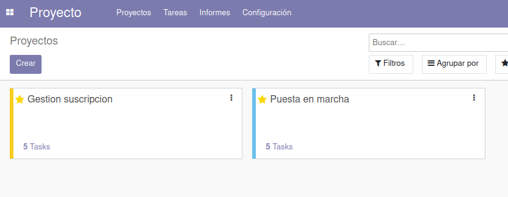
Gestion global del tablero

A continuacion observamos mas a detalle las tareas dentro de cada proyecto, en este caso vamos a observar el proyecto de **Puesta en marcha**.

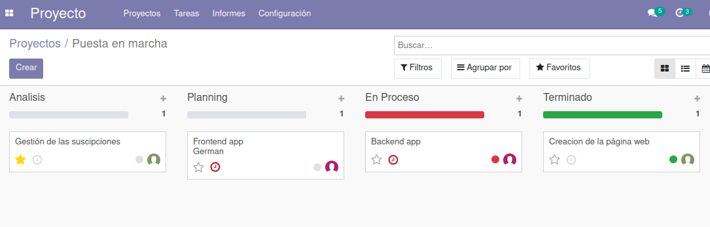

Se puede observar que este proyecto consta de varias tareas, la cuales, se pueden asignar a favoritos, hacer un seguimiento de la tarea, asignar a un trabajor en concreto entre otras cosas, asi como se puede apreciar en la siguiente imagen.

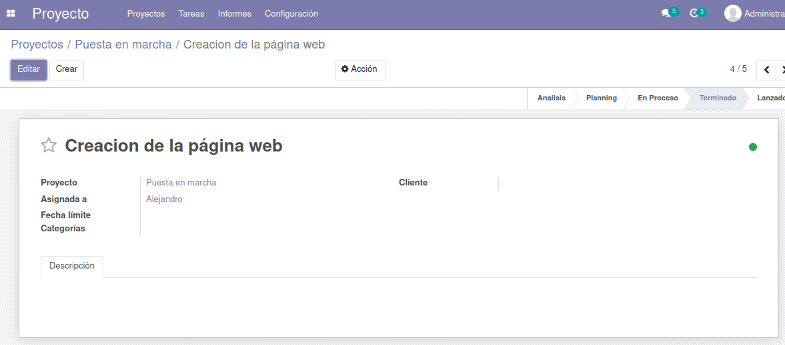

## Servicios
El servicio que emplea Conety es la venta de suscripciones de vpn el cual tiene cuatro tipos diferentes.

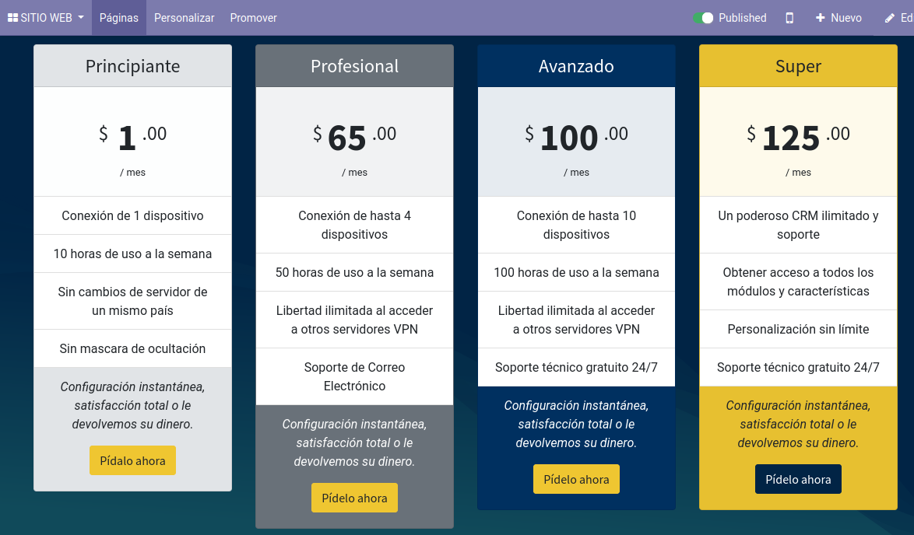
suscripciones vpn

Una vez se tenga claroque suscripcion se desea, es tan sencillo como en clicar **Pidelo ahora** para poder comprarlo.
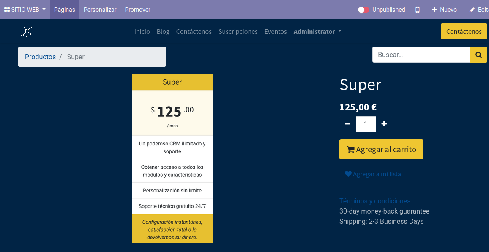

Se puede añadir al carrito para finalmente poder gestionar la compra.

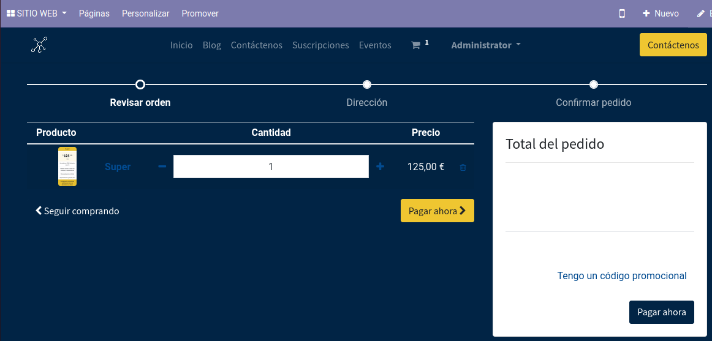

En cuanto a la gestion de pago, simplemente hay que añadir la dirección.

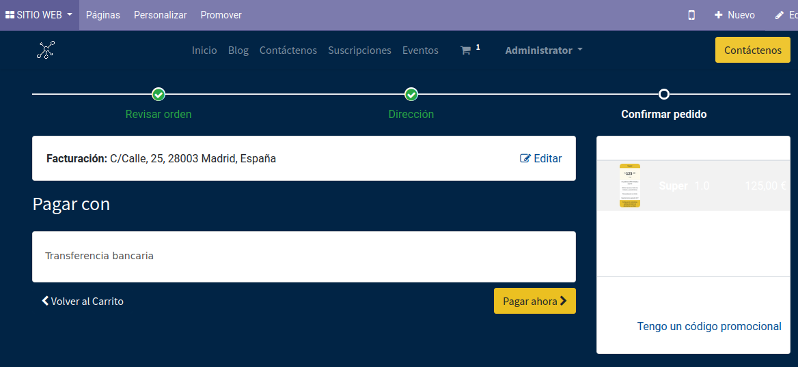

Y finalmente confirmar el pedido.

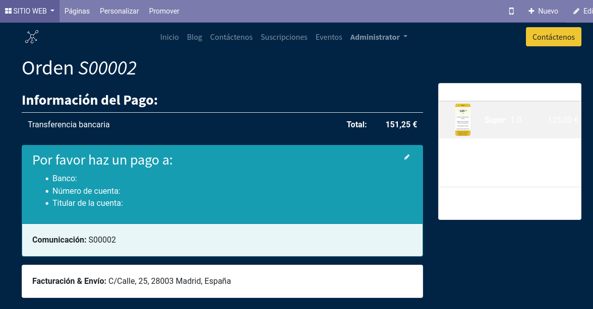

En cuanto a la gestión interna del servicio se ha creado un punto de venta con las firentes suscripciones como se aprecia en la siguiente imagen.

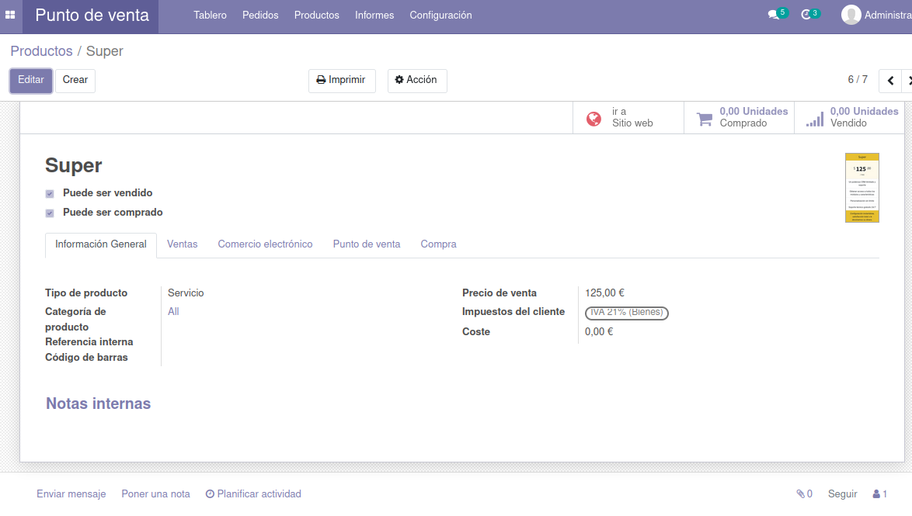
## Agenda

Para poder mantener un orden de cada proyecto, Conety realiza una agenda en la que se puede estructurar de diversas maneras, por ejemplo se puede gestionar un calendario con reuniones que duran un día o unas horas.

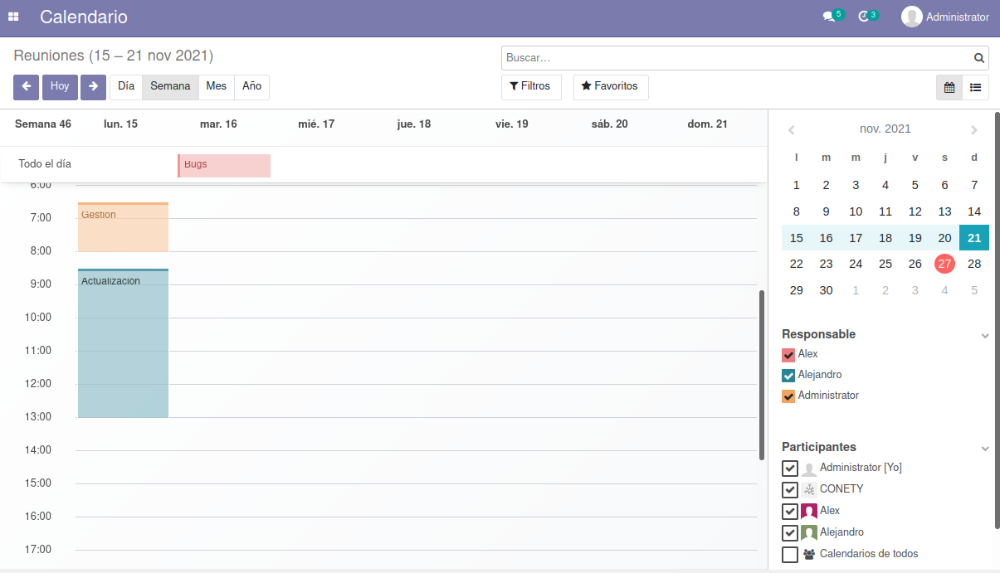
Calendario de reuniones.

Entrando un poco mas en detalles, se puede observar que cada actividad en el calendario esta etiquetado en colores, eso hace alusión a la persona que ha creado la tarea, así como los participantes.

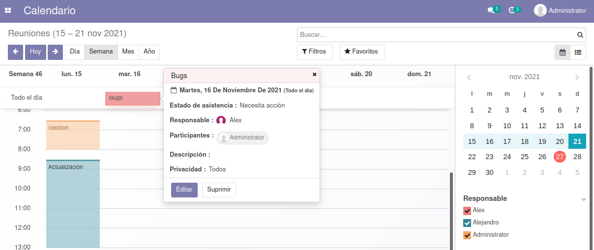
Detalles de una actividad.

Finalmente podemos ver las descripcion de una **Reunión** en concreto, en la que se puede apreciar la fecha,hora, duracion de la reunión; Estado de asistencia, el responsable, es decir quien lo ha gestionado, los participantes que estan involucrados, descripción si fuera necesario y privacidad a los cuales quienes estan involucrados.

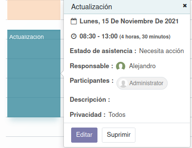
Descripción mas detallada.

## Eventos marketing

A la hora de programar algún evento Conety ha decidido usar la herramienta que puedes incorporar a odoo llamada **eventos**

En la imagen podemos observar cómo se divide en columnas según el estado en el que está el evento (Reservado, Anunciado ...), hay un evento ya programado por Conety llamado "*Conferencia primer lanzamiento*" en la columna "*Anunciado*". En la carta del evento podemos ver la fecha, nombre, lugar, asistentes esperados, qué empleados llevan el evento etc.. todo esto de una forma ordenada y fácil a la vista.

En la siguiente captura podemos ver más detalles del evento, incluso trabajar con él.

Desde aquí podemos ver la información más detallada e incluso editar campos como las fechas o la cantidad de entradas que queremos vender.

Ya dentro de la página web, en la pestaña de "*Eventos*" podemos acceder a la compra de las entradas o, nuevamente, a información sobre el evento. Toda esta vista de la página web es lo que está accesible para cualquier persona.  

## Comunicacion interna

En Conety hemos decidido usar una comunicación interna vía odoo en el apartado conversaciones.

Desde aquí se puede iniciar conversaciones con cualquier contacto de la agenda e incluso crear grupos de chat o distintas funciones propias de un gestor de correos electronicos, como marcar en destacados los mensajes o enviárselos a varias personas. 

## Gestión de contactos

Para una gestión de contactos eficiente y fluida hemos decidido usar la agenda propia de odoo la cuál ofrece un resumen con la información de los contactos.

## Control de versiones

Para poder gestionar tanto la base de datos como la pagina web y odoo, se ha recurrido a crear un repositorio en github, el cual tiene tres ramas, la rama master, Pallango y Martin. Se ha creado tres ramas para poder trabajar cooperativamente en cuanto al README y juntarlo todo en la rama master, asi cualquier modificacion de la base de datos como la documentacion, se actualiza constantemente por si hubiera alguna perdida de la información, si ese fuera el caso se podria recuperar una version mas reciente de ello.

## Copias de seguridad

En cuanto a la base de datos, para mantener toda la información bien resguardada, se ha comprimido y se ha cifrado para posteriormente poder subirla y si fuera necesario recupararla y decifrarla con una contraseña.

## Autores

Alex Pallango y Alejandro Martín con la ayuda de nuestro profesor Ernesto Ramiro y los múltiples tutoriales disponibles en la web de Odoo.