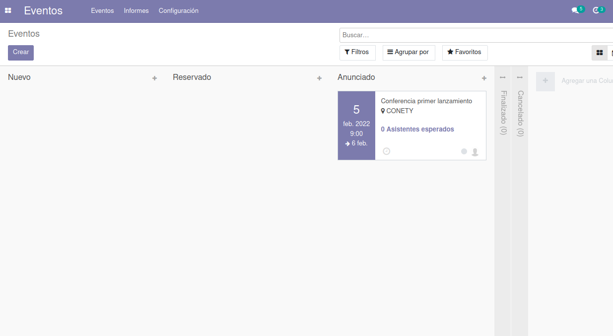
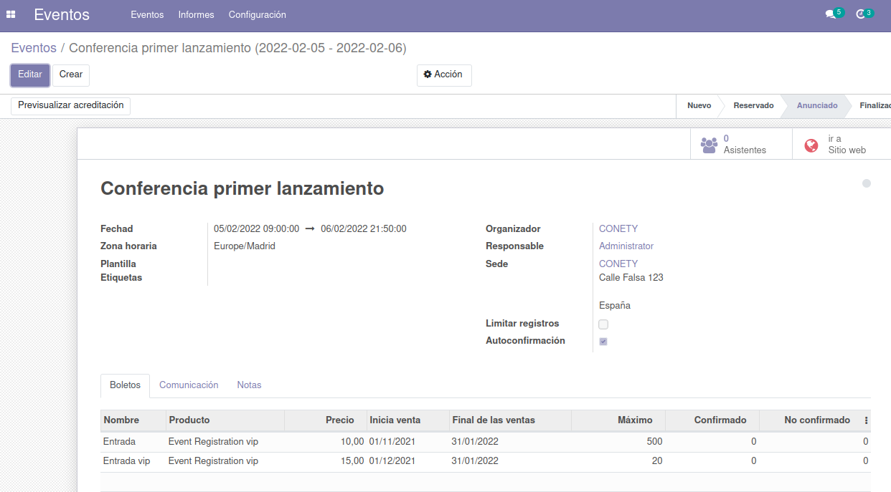
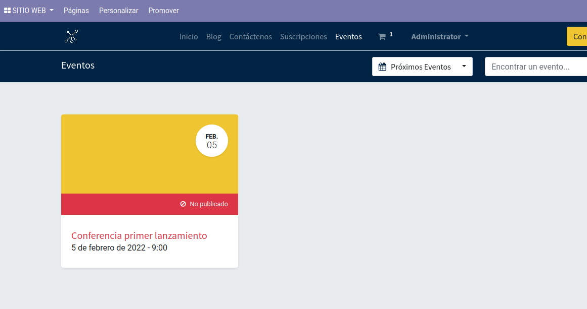
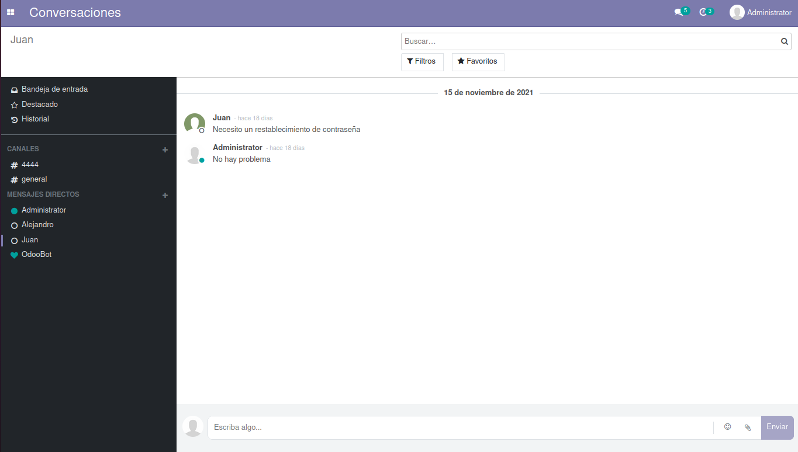
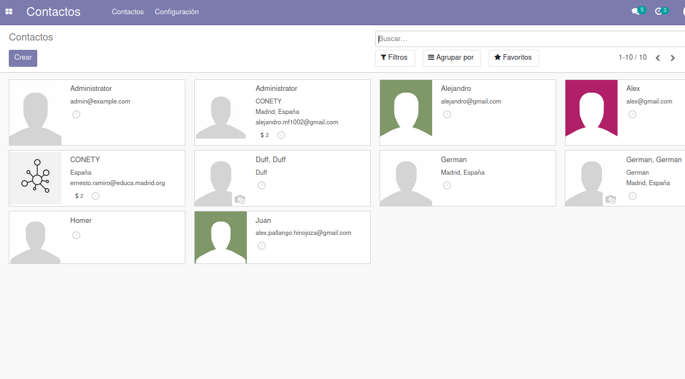

# Conety
## Pagina Web

## Tablero

## Servicios

## Agenda

## Eventos marketing

A la hora de programar algún evento Conety ha decidido usar la herramienta que puedes incorporar a odoo llamada **eventos**

En la imagen podemos observar cómo se divide en columnas según el estado en el que está el evento (Reservado, Anunciado ...), hay un evento ya programado por Conety llamado "*Conferencia primer lanzamiento*" en la columna "*Anunciado*". En la carta del evento podemos ver la fecha, nombre, lugar, asistentes esperados, qué empleados llevan el evento etc.. todo esto de una forma ordenada y fácil a la vista.

En la siguiente captura podemos ver más detalles del evento, incluso trabajar con él.

Desde aquí podemos ver la información más detallada e incluso editar campos como las fechas o la cantidad de entradas que queremos vender.

Ya dentro de la página web, en la pestaña de "*Eventos*" podemos acceder a la compra de las entradas o, nuevamente, a información sobre el evento. Toda esta vista de la página web es lo que está accesible para cualquier persona.  

## Comunicacion interna

En Conety hemos decidido usar una comunicación interna vía odoo en el apartado conversaciones.

Desde aquí se puede iniciar conversaciones con cualquier contacto de la agenda e incluso crear grupos de chat o distintas funciones propias de un gestor de correos electronicos, como marcar en destacados los mensajes o enviárselos a varias personas. 

## Gestión de contactos

Para una gestión de contactos eficiente y fluida hemos decidido usar la agenda propia de odoo la cuál ofrece un resumen con la información de los contactos.

## Control de versiones

## Copias de seguridad

## Autores

Alex Pallango y Alejandro Martín con la ayuda de nuestro profesor Ernesto Ramiro y los múltiples tutoriales disponibles en la web de Odoo.